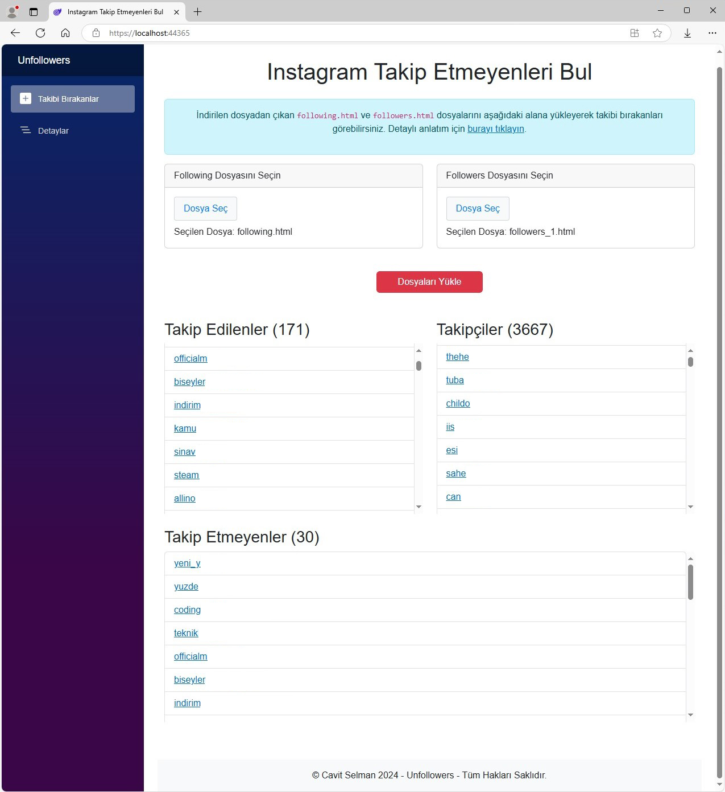
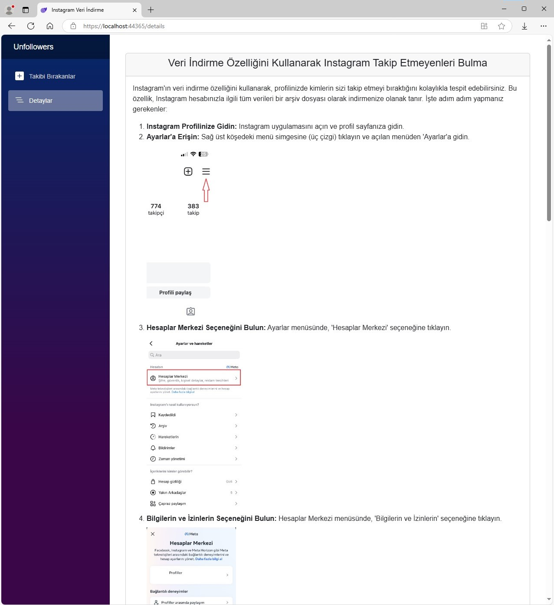

<h1 align="center">Instagram Takip Etmeyenleri Bul</h1>

Bu proje, Instagram kullanıcılarının takip ettiği ancak karşılıklı olarak takip etmeyen kişileri tespit etmeyi amaçlayan bir web uygulamasıdır. Kullanıcılar, Instagram verilerini indirip yükleyerek takip etmeyen kişileri öğrenebilir. Bu işlem Instagram hesabına giriş yapmaya, şifre girmeye veya üçüncü taraf uygulamalara ihtiyaç duymadan yapılabilir. Kullanıcılar yalnızca Instagram'ın sunduğu veri indirme özelliğiyle elde ettikleri following.html (takip edilenler) ve followers.html (takipçiler) dosyalarını yükleyerek, hızlıca karşılaştırma yapabilirler.

Dosyaları indirmek ve yüklemek için daha detaylı açıklamalar "Detaylar" sayfasında mevcuttur.

<h2>Özellikler</h2>

<ul>
    <li><strong>Instagram Hesabınıza Giriş Yapmadan Takip Etmeyenleri Bulun: Instagram verilerini indirip yükleyerek, takip etmeyen kişilerin listesine erişebilirsiniz.</strong></li>
    <li><strong>Veri İndirme Özelliği Kullanılır: Üçüncü taraf uygulamaları kullanmaya gerek kalmadan, Instagram'ın sunduğu veri indirme özelliği ile elde ettiğiniz verilerle işlem yapabilirsiniz.</strong></li>
    <li><strong>Basit ve Hızlı İşlem: Yalnızca followers.html ve following.html dosyalarını yükleyerek, takip etmeyen kişileri kolayca öğrenebilirsiniz.</strong></li>
</ul>

<h2>Kullanılan Teknolojiler</h2>

<ul>
    <li><strong>.NET 9.0: Uygulama, .NET 9.0 framework'ü kullanılarak geliştirilmiştir. Bu versiyon, yüksek performans, modern web uygulamaları için ideal özellikler sunar.       </strong></li>    
    <li><strong>Blazor WebAssembly: C# dilinde geliştirilen interaktif bir web uygulaması.</strong></li>
    <li><strong>HTML Agility Pack: HTML dosyalarından Instagram kullanıcı adlarını çıkarmak için kullanıldı.</strong></li>
    <li><strong>Bootstrap: Responsive tasarım için kullanılan CSS framework'ü.</strong></li>
    <li><strong>ASP.NET Core: Web uygulamasının backend kısmında kullanılan framework.</strong></li>
</ul>

<h2>Proje Görselleri</h2>

